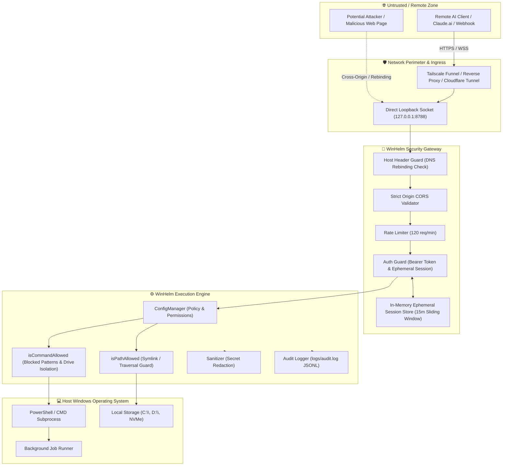

# WinHelm MCP Threat Model & Security Architecture

This document provides a comprehensive threat model for **WinHelm MCP** following the **STRIDE** methodology (Spoofing, Tampering, Repudiation, Information Disclosure, Denial of Service, Elevation of Privilege). It maps trust boundaries, analyzes potential attack vectors, outlines defense-in-depth mitigations, and documents operational assumptions and residual limitations.

---

## 1. System Overview & Trust Boundaries

WinHelm MCP bridges AI orchestrators (e.g., Claude.ai, Cursor, Claude Code, custom LLM agents) and local Windows environments via Model Context Protocol (MCP) streamable HTTP and SSE transports.

### Trust Boundary Architecture Diagram

### Trust Boundary Definitions

1. **Boundary 1 (Client to Network Perimeter):** Any connection originating from the public Internet, untrusted web browsers, or remote LLM cloud servers. Assumed untrusted.
2. **Boundary 2 (Perimeter to Gateway):** Direct TCP/HTTP traffic arriving at WinHelm's listening port (`8788`). Must undergo strict header, origin, rate, and credential verification.
3. **Boundary 3 (Gateway to Engine):** Authenticated requests entering the tool invocation dispatcher. Every file path and terminal command is subjected to path normalization and command policy validation.
4. **Boundary 4 (Engine to Host OS):** Child processes spawned via Node's `child_process` and direct filesystem I/O executing under the operating system permissions of the running Windows user account.

---

## 2. STRIDE Threat Analysis Matrix

| Threat Category | Threat Description | Attack Vector / Scenario | WinHelm Mitigation Strategy | Residual Risk & Status |
| :--- | :--- | :--- | :--- | :--- |
| **S**poofing | **DNS Rebinding** | Malicious website scripts make requests to `http://localhost:8788` by rebinding attacker DNS to `127.0.0.1`. | Strict `Host` header validation (`isHostAllowed`). Blocks any request whose `Host` header is not loopback, bind interface, Tailscale CGNAT IP, or authorized domain. `Host: 0.0.0.0` is explicitly rejected. | **Mitigated** |
| **S**poofing | **Token Forgery & Replay** | Attacker intercepts or forges long-lived authentication tokens. | Ephemeral session tokens (`winhelm_session`) generated via `crypto.randomBytes(32)` (64-character unguessable hex). 15-minute sliding TTL with a 12-hour absolute maximum lifetime cap. Master `authToken` compared with `crypto.timingSafeEqual`. One-time exchange tokens (`?exchange=...`) destroyed upon first use. | **Mitigated** |
| **T**ampering | **Directory Traversal** | Path manipulation (`../`, `..\\`, UNC paths `\\\\server\\share`, symlinks) attempting to access files outside `allowedDirectories`. | Strict path validation (`isPathAllowed`). Target paths resolved to canonical disk locations using `fs.realpathSync` to defeat symlink/junction bypasses. UNC paths blocked. | **Mitigated** |
| **T**ampering | **Configuration Mutation** | Unprivileged requests attempting to persist dangerous runtime config changes. | `winhelm.config.json` mutations require explicit `--persist` flag; CLI overrides are in-memory session-only by default. Fail-closed defaults. Priority config loading for `winhelm.local.json`. | **Mitigated** |
| **R**epudiation | **Untraceable Operations** | Malicious actor executes disruptive commands without attribution or timestamped audit trail. | Append-only structured JSONL audit log (`logs/audit.log`) recording client IP, action, resource, outcome, and timestamp with automated size-based rotation. Session IDs hashed via SHA-256 (first 12 chars). | **Mitigated** |
| **I**nformation Disclosure | **Credential Leakage** | API keys (`sk-...`, `ghp_...`), AWS credentials (`AKIA...`), or Bearer tokens printed to logs, console, or browser history. | Automated multi-pattern sanitizer (`sanitizeText`, `sanitizeObject`). Ephemeral token exchange (`POST /auth/exchange`) strips query tokens from URLs on browser navigation. Child process environment variables sanitized (`getCleanChildEnv`) to prevent secret leakage to subprocesses. | **Mitigated** |
| **I**nformation Disclosure | **Unrestricted System Files** | Reading sensitive Windows files (SAM, SYSTEM, BitLocker keys, user profiles) from `C:\`. | `allowSystemExecution: false` by default (fail-closed containment). All accesses outside `allowedDirectories` are strictly rejected. Effective working directories verified against boundary. | **Mitigated** |
| **D**enial of Service | **HTTP Request Flooding** | Rapid requests to streamable HTTP or monitor endpoints exhausting server resources. | Built-in token-bucket rate limiter (`RateLimiter`, default 120 req/min). Returns HTTP 429 with `Retry-After` header. Health checks exempted. | **Mitigated** |
| **D**enial of Service | **Unbounded Job Spawning & Buffer Bloat** | Excessive background tasks consuming all system CPU or RAM, or commands generating gigabytes of output. | Concurrency limit on active MCP sessions and background tasks; automated eviction and termination of idle sessions. Stdout/stderr capped at 1 MB per stream; task output buffer capped at 1 MB. Process tree termination via `taskkill /PID /T /F` on timeout. File previews capped at 5 MB. | **Mitigated** |
| **E**levation of Privilege | **Command Injection / Destructive Shell** | Malicious prompts invoking dangerous commands (`format`, `rmdir /s /q`, `reg delete`, encoded PowerShell scripts, Unicode smart quote injections). | Blocked commands list and regex patterns (`blockedCommands`, `blockedCommandPatterns`). Unicode smart quotes (`\u2018`, `\u2019`, etc.) escaped via `psQuote()`. System tool parameters passed via isolated environment variables (`$env:WH_ARG_*`). Direct reference to unauthorized drive letters blocked when `allowSystemExecution: false`. | **Mitigated** |

---

## 3. Assumptions & Operational Preconditions

WinHelm's security model relies on the following operational assumptions:

1. **Host Integrity:** The host machine running WinHelm is not already compromised by local malware or an unprivileged rogue user with arbitrary local memory inspection capabilities.
2. **Token Secrecy:** The administrator maintains the secrecy of the master `authToken` and does not check secrets into version control or publish them on public forums.
3. **Loopback Protection:** If bound to non-loopback addresses (`0.0.0.0` or LAN IPs), an authentication token is **mandatory**; WinHelm enforces a fail-closed startup gate that refuses to start without an authentication token (exits with code 1).
4. **Proxy Trust:** When deployed behind reverse proxies or tunnels (Tailscale Funnel, Cloudflare Tunnel), the tunnel must properly pass the client's actual remote IP or strip untrusted `X-Forwarded-For` headers. WinHelm defaults to `trust proxy: loopback` for local proxies.
5. **HTTPS on Public Networks:** On local loopback (`127.0.0.1`), HTTP plaintext is contained within the local kernel loopback interface. However, whenever WinHelm is exposed across a public network or shared LAN, administrators **must** terminate TLS (via Tailscale HTTPS or an SSL-terminating reverse proxy) so that the `Secure` attribute on `winhelm_session` cookies is active and wiretapping is prevented.

---

## 4. Known Limitations & Defense-in-Depth Recommendations

While WinHelm provides multiple layers of automated containment, administrators must understand the following inherent characteristics of Windows-based execution environments:

### 1. Process-Level Execution Context
WinHelm runs with the permissions of the Windows user account that started the process. It does not run inside a dedicated Hyper-V microVM or isolated container. If WinHelm is started from an elevated Administrator PowerShell prompt, any allowed command runs with elevated privileges.
- **Recommendation:** Run WinHelm under a dedicated standard (non-administrator) Windows service account.

### 2. Administrator Overrides (`--system-exec` and `allowedDirectories: ["*"]`)
If an administrator explicitly launches WinHelm with `--system-exec` and configures `allowedDirectories: ["*"]`, the safety containment is intentionally disarmed to grant full system automation power to the AI orchestrator.
- **Recommendation:** Only use `--system-exec` on dedicated development machines or virtual machines, never on production workstations containing sensitive personal or organizational credentials.

### 3. Native Windows Shell Capabilities
PowerShell and CMD feature vast standard utility libraries (`rundll32`, `certutil`, `wmic`). While WinHelm actively filters known destructive patterns, blacklist-based regex filtering cannot theoretically guarantee complete prevention against all obfuscated Windows script payloads without white-list execution.
- **Recommendation:** Keep `readOnly: true` or maintain restricted `allowedDirectories` on workstations where full write access is unnecessary.

### 4. Residual Risk: Session Hijacking
If the host workstation is compromised by local info-stealer malware or an attacker has local debugging access to the user's browser profile, session cookies stored in browser memory could be exfiltrated.
- **Mitigation:** Ephemeral sessions expire after 15 minutes of inactivity (`Max-Age=900; SameSite=Strict; HttpOnly`) with sliding window renewal, minimizing the window of opportunity.

### 5. Residual Risk: Token Replay Mitigation via One-Time Exchange Tokens
Re-using authentication tokens found in browser history or proxy logs represents a common web threat.
- **Mitigation:** Browser login URLs utilize single-use exchange tokens (`?exchange=...`) with a 5-minute TTL. Once consumed, the token is invalidated immediately on the server. Replaying an already-consumed exchange token yields HTTP 401 Unauthorized.
